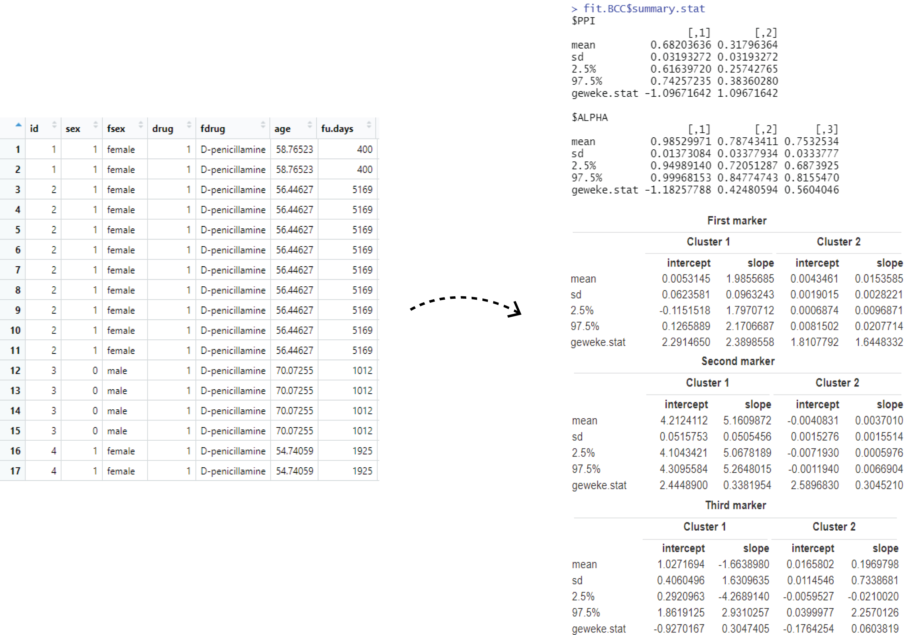

<!-- README.md is generated from README.Rmd. Please edit that file -->

# BCCLong

<!-- badges: start -->
<!-- badges: end -->

The goal of BCCLong is to compute a Bayesian Consensus Clustering (BCC)
model for mixed-type longitudinal data

## Description

Statistical methods for clustering a single longitudinal trajectory have
been well-developed and widely used in many different medical research
areas. However, it is very common these days to encounter situations
where several longitudinal markers or responses are collected
simultaneously in a study and there is a growing interest to examine how
multiple longitudinal characteristics could collectively contribute to
disaggregating disease heterogeneity. Therefore, the `BCClong` package
has been created. `BCClong` is an R package for performing Bayesian
Consensus Clustering (BCC) model for clustering continuous, discrete and
categorical longitudinal data, which are commonly seen in many clinical
studies [Lu et al., 2021](https://doi.org/10.1002/sim.9225).

## Installation

You can install the development version of BCC from
[GitHub](https://github.com/) with:

``` r
# install.packages("devtools")
devtools::install_github("ZhiwenT/BCClong", build_vignettes = TRUE)
library("BCClong")
```

## Overview

To list all the functions available in the package:

``` r
ls("package:BCClong")
```

Currently, there are 1 function ***BCC.multi*** in this package which
will provide a summary statistics for the computed model.

An overview of the package is illustrated below:

<div style="text-align:center">

<div style="text-align:left">

The package tree structure is provide below

``` r
- BCClong
  |- BCClong.Rproj
  |- DESCRIPTION
  |- NAMESPACE
  |- LICENSE
  |- README
  |- inst
    |- extdata
      |- Epileptic.rds
      |- PBCseq.rds
      |- MeanAdj.png
      |- procedure.png
    |-CITATION
  |- man
    |- BCC.multi.Rd
  |- R
    |- bcclong.R
    |- RcppExports.R
  |- src
    |- BCC.cpp
    |- RcppExports.cpp
    |- Makevars
    |- Makevars.win
  |- vignettes
    |- ContinuousData.Rmd
    |- MixedTypeData.Rmd
```

## Tutorials

For tutorials and plot interpretation, refer to the vignette:

``` r
browseVignettes("BCClong")
```

Three options include a HTMl version, source R markdown file and R code
file. There are two tutorials in this package, one is for dataset with
continuous data only, and the second one is for dataset with mixed type
of data. Tutorial can also be found from the link below. Make sure to
open the html file in browser, the github website only shows the source
code.

Continuous variables only:

<https://github.com/ZhiwenT/BCClong/blob/main/vignettes/ContinuousData.html>

Mixed type variables:

<https://github.com/ZhiwenT/BCClong/blob/main/vignettes/MixedTypeData.html>

## Citation for Package

``` r
citation("BCClong")
```

Tan, Z., Shen, C., Lu, Z. (2022) BCClong: an R package for performing
Bayesian Consensus Clustering model for clustering continuous, discrete
and categorical longitudinal data. URL
<https://github.com/ZhiwenT/BCClong>

## References

-   [Lu, Z., & Lou, W. (2021). Bayesian consensus clustering for
    Multivariate Longitudinal Data. *Statistics in Medicine*, 41(1),
    108–127.](https://doi.org/10.1002/sim.9225)

## Maintainer

-   Zhiwen Tan (<z.tan@queensu.ca>).

## Contributions

`BCClong` welcomes issues, enhancement requests, and other
contributions. To submit an issue, use the [GitHub
issues](https://github.com/ZhiwenT/BCClong/issues).
