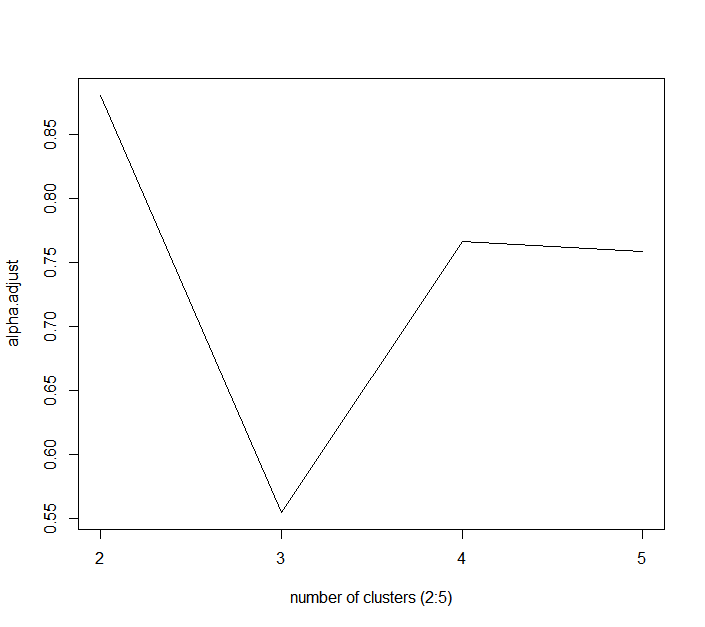

```{r, include = FALSE}
knitr::opts_chunk$set(
  collapse = TRUE,
  comment = "#>"
)
```

## Introduction

`BCClong` is an R package for performing Bayesian Consensus Clustering (BCC) model for clustering continuous, discrete and categorical longitudinal data, which are commonly seen in many clinical studies. This document gives a tour of BCClong package.

see `help(package = "BCClong")` for more information and references provided by `citation("BCClong")`

To download **BCClong**, use the following commands:

``` r
require("devtools")
devtools::install_github("ZhiwenT/BCClong", build_vignettes = TRUE)
library("BCClong")
```
To list all functions available in this package:

```r
ls("package:BCClong")
```

## Components

Currently, there are 1 function __*BCC.multi*__ in this package which will provide a summary statistics for the computed model. To use this function, the input dataset requires some pre-process. Here, we are given an example to provide an work flow for this package.

## Pre-process (Setting up)

In this example, the `epileptic.qol` data set from `joinrRML` package was used. The variables used here include `anxiety score`, `depress score` and `AEP score`. All of the variables are continuous.

```{r, warning=F, message=F}
library(joineRML)
data(epileptic.qol)
epileptic.qol <- epileptic.qol[order(epileptic.qol$id,epileptic.qol$time),]  # Sort by ID and time
epileptic.qol$time_month <- epileptic.qol$time/30.25

epileptic.qol <- epileptic.qol[is.na(epileptic.qol$anxiety)==FALSE,]
epileptic.qol <- epileptic.qol[is.na(epileptic.qol$depress)==FALSE,]
epileptic.qol <- epileptic.qol[is.na(epileptic.qol$aep)==FALSE,]

# remove observations (not individuals) where all three markers are NA
epileptic.qol <- epileptic.qol[!(is.na(epileptic.qol$anxiety)==TRUE & is.na(epileptic.qol$depress)==TRUE  & is.na(epileptic.qol$aep)==TRUE),]

# create a new ID variable with values from 1 to N;
subj <- unique(epileptic.qol$id)
N <- length(subj)
id.new <- NULL
for (i in 1:N) {id.new   <- c(id.new, 
                              rep(i,length(epileptic.qol[epileptic.qol$id==subj[i],]$id)))}
epileptic.qol$id.new <- id.new

epileptic.qol$anxiety_scale <- scale(epileptic.qol$anxiety)
epileptic.qol$depress_scale <- scale(epileptic.qol$depress)
epileptic.qol$aep_scale <- scale(epileptic.qol$aep)
epileptic.qol$timec <- epileptic.qol$time - mean(epileptic.qol$time)

dat <- epileptic.qol
```

## Choose Best Number Of Clusters

We Compute the mean adjusted adherence to determine the number of clusters. The code below tooks about 15 minutes on an AMD Ryzen^{TM} 5 5600X desktop computer.

```r
set.seed(22232)
alpha.adjust <- NULL
for (k in 2:5){ 
fit.BCC <- BCClong::BCC.multi (
  mydat = list(dat$anxiety_scale,dat$depress_scale,dat$aep_scale),
  dist = c("gaussian","gaussian","gaussian"),
  id = list(dat$id.new,dat$id.new,dat$id.new),
  time = list(dat$timec,dat$timec,dat$timec),
  formula =list(y ~ time +  (1 |id),
                y ~ time +  (1 |id),
                y ~ time +  (1 |id)),
  num.cluster = k,
  hyper.par  = list(delta=1,a.star=1,b.star=1,aa0=0.001, bb0=0.001, 
                    ww0=0,vv0=25, cc0=0.001, dd0=0.001,rr0=0.001,RR0=0.001),
  sigma.sq.e.common = 1, 	
  c.ga.tuning = list(1,1,1),		    # tuning parameter for MH algorithm (fixed effect parameters), each parameter corresponds to an outcome/marker		
  c.theta.tuning = list(1,1,1),		# tuning parameter for MH algorithm (random effect), each parameter corresponds to an outcome/marker
  adaptive.tuning = 0,	      		# adaptive tuning parameters, 1 - yes, 0 - no
  align.clusters=0,			# assign clusters	 
  alpha.common=0,				# 1 - common alpha, 0 - separate alphas for each outcome
  sig.var = 0,				  # 1 - unstructure random effect variance, 0 - diagonal random effect variance structure
  initials= NULL,			  # initial values for model parameters
  initial.cluster.membership = "random", # "mixAK" or "random"
  print.info="FALSE",
  burn.in = 100, 			  # number of samples discarded
  thin = 1, 				    # thinning
  per = 100, 				      # output information every "per" iteration 
  max.iter = 600) 			# maximum number of iteration 
alpha.adjust <- c(alpha.adjust, fit.BCC$alpha.adjust)
}
# plot the mean adjusted adherence: the model has the largest mean adjusted adherence when the number of clusters is 2
plot(2:5, alpha.adjust, type="l",cex=2, xlab = "number of clusters (2:5)", xaxt="none")
axis(1, seq(2,5,1))
```
Since this takes long time, we have provided the compiled plot below:

```{r, echo=F}

```

## Fit BCC Model Using BCC.multi Function

Here, We used Gaussian distribution for all three markers. The number of clusters was setted to 2 becasue it has highest mean adjusted adherence. For the hyper-parameters of the adherence parameters $\alpha_r$, we set $\delta_{1,r} = \delta_{2,r} = 1$ for $r = 1,2,3$ For the global clustering propertion $\pi$, we set $\varphi = (1,...,1)$ which reflects no priori information favouring one cluster over the other. For the fixed effect coefficients $\gamma_{k,r}$, we are setting the value to list(1,1,1). For random effect $\theta$, we are setting the value to list(1,1,1).

We ran the model with 2,000 iterations, discard the first 1,000 sample, and kept every sample. This resulted in 1,000 samples for each model parameter. The MCMC sampling process tooks about 15 minutes on an AMD Ryzen$^{TM}$ 5 5600X desktop computer.

Since this program takes a long time to run, here we will use the pre-compile result in this example. The pre-compiled data file can be found here (`./inst/extdata/Epileptic.rds`)

```r
# Fit the final model with the number of cluster 2 (largest mean adjusted adherence)
fit.BCC <- BCClong::BCC.multi (
  mydat = list(dat$anxiety_scale,dat$depress_scale,dat$aep_scale),
  dist = c("gaussian","gaussian","gaussian"),
  id = list(dat$id.new,dat$id.new,dat$id.new),
  time = list(dat$timec,dat$timec,dat$timec),
  formula =list(y ~ time +  (1 |id),
                y ~ time +  (1 |id),
                y ~ time +  (1 |id)),
  num.cluster = 2,
  hyper.par  = list(delta=1,a.star=1,b.star=1,aa0=0.001, bb0=0.001, 
                    ww0=0,vv0=25, cc0=0.001, dd0=0.001,rr0=0.001,RR0=0.001),
  sigma.sq.e.common = 1, 	
  c.ga.tuning = list(1,1,1),		    # tuning parameter for MH algorithm (fixed effect parameters), each parameter corresponds to an outcome/marker		
  c.theta.tuning = list(1,1,1),		# tuning parameter for MH algorithm (random effect), each parameter corresponds to an outcome/marker
  adaptive.tuning = 0,	      		# adaptive tuning parameters, 1 - yes, 0 - no
  align.clusters=0,			# assign clusters	 
  alpha.common=0,				# 1 - common alpha, 0 - separate alphas for each outcome
  sig.var = 0,				  # 1 - unstructure random effect variance, 0 - diagonal random effect variance structure
  initials= NULL,			  # initial values for model parameters
  initial.cluster.membership = "mixAK", # "mixAK" or "random"
  print.info="FALSE",
  burn.in = 1000, 			  # number of samples discarded
  thin = 1, 				    # thinning
  per = 100, 				      # output information every "per" iteration 
  max.iter = 2000) 			# maximum number of iteration 
```
To run the pre-compiled result, please download the `Epileptic.rds` object from github under `inst/extdata/` folder. Then run the following code.

```{r, warning=F, message=F}
# pre-compiled result
fit.BCC <- readRDS("../inst/extdata/Epileptic.rds")
```

To print the summary statistics for all parameters 

```r
fit.BCC$summary.stat
```

To print the proportion \pi for each cluster (mean, sd, 2.5% and 97.5% percentile)
geweke statistics (geweke.stat) between -2 and 2 suggests the parameters converge

```r
fit.BCC$summary.stat$PPI
```

## Visualize Clusters

To plot the results, `ggplot2` and `cowplot` are used here. Other plotting methods can also be used, here is just an example. From the following code, we can get 6 plots for 3 markers, each marker has a plot for local clustering and a plot for global clustering. 

```{r, fig.height=10, fig.width=8, warning=F, message=F}
num.clust <- fit.BCC$num.cluster
dat <- fit.BCC$dat 
#-----------------------------------------------------------------#
dat[[1]]$cluster.local <- factor(dat[[1]]$cluster.local)
per <- round(100*table(fit.BCC$cluster.local[[1]])/N,1)
dat[[1]]$cluster.local <- factor(dat[[1]]$cluster.local,labels =paste("Cluster ",1:num.clust," (",per,"%)",sep=""))
dat[[1]]$time2 <- dat[[1]]$time  


library(ggplot2)
library(cowplot)

gp1 <- ggplot(data = dat[[1]], aes(x =time2, y =y, color=cluster.local,linetype=cluster.local,fill=cluster.local))+
  geom_smooth(method = "loess", size = 3,se = FALSE,span=2)+
  theme_bw() + 
  ggtitle(expression(paste("Anxiety score (",hat(alpha), " = 0.97 )", sep=""))) + 
  xlab("Time (months)") +    ylab("Anxiety score")  +
  theme(legend.position ="bottom",legend.key.size = unit(0.5, 'cm'),
        legend.title=element_blank(),
        plot.title = element_text(size = 15),
        legend.text=element_text(size=10),
        axis.text=element_text(size=20),
        axis.title=element_text(size=20),
        axis.text.x = element_text(size=20,angle = 0 ,hjust=0.95,vjust=0.2),
        strip.background = element_blank(),
        strip.text.x =element_blank(),
        strip.text.y = element_blank()) +
  guides(color=guide_legend(nrow=1,byrow=TRUE,reverse=FALSE),
         linetype=guide_legend(nrow=1,byrow=TRUE,reverse=FALSE),
         shape=guide_legend(nrow=1,byrow=TRUE,reverse=FALSE),
         fill=guide_legend(nrow=1,byrow=TRUE,reverse=FALSE)) 

#-----------------------------------------------------------------#
dat[[2]]$cluster.local <- factor(dat[[2]]$cluster.local)
per <- round(100*table(fit.BCC$cluster.local[[2]])/N,1)
dat[[2]]$cluster.local <- factor(dat[[2]]$cluster.local,labels =paste("Cluster ",1:num.clust," (",per,"%)",sep=""))
dat[[2]]$time2 <- dat[[2]]$time  

gp2 <- ggplot(data = dat[[2]], aes(x =time2, y =y, color=cluster.local,linetype=cluster.local,fill=cluster.local))+
  geom_smooth(method = "loess", size = 3,se = FALSE,span=2)+
  theme_bw() + 
  ggtitle(expression(paste("Depress score (",hat(alpha), " = 0.92 )", sep=""))) + 
  xlab("Time (months)") +    ylab("Depress score")  +
  theme(legend.position ="bottom",legend.key.size = unit(0.5, 'cm'),
        legend.title=element_blank(),
        plot.title = element_text(size = 15),
        legend.text=element_text(size=10),
        axis.text=element_text(size=20),
        axis.title=element_text(size=20),
        axis.text.x = element_text(size=20,angle = 0 ,hjust=0.95,vjust=0.2),
        strip.background = element_blank(),
        strip.text.x =element_blank(),
        strip.text.y = element_blank()) +
  guides(color=guide_legend(nrow=1,byrow=TRUE,reverse=FALSE),
         linetype=guide_legend(nrow=1,byrow=TRUE,reverse=FALSE),
         shape=guide_legend(nrow=1,byrow=TRUE,reverse=FALSE),
         fill=guide_legend(nrow=1,byrow=TRUE,reverse=FALSE)) 

#-----------------------------------------------------------------#
dat[[3]]$cluster.local <- factor(dat[[3]]$cluster.local)
per <- round(100*table(fit.BCC$cluster.local[[3]])/N,1)
dat[[3]]$cluster.local <- factor(dat[[3]]$cluster.local,labels =paste("Cluster ",1:num.clust," (",per,"%)",sep=""))
dat[[3]]$time2 <- dat[[3]]$time  

gp3 <- ggplot(data = dat[[3]], aes(x =time2, y =y, color=cluster.local,linetype=cluster.local,fill=cluster.local))+
  geom_smooth(method = "loess", size = 3,se = FALSE,span=2)+
  theme_bw() + 
  ggtitle(expression(paste("AEP score (",hat(alpha), " = 0.93 )", sep=""))) + 
  xlab("Time (months)") +    ylab("AEP score")  +
  theme(legend.position ="bottom",legend.key.size = unit(0.5, 'cm'),
        legend.title=element_blank(),
        plot.title = element_text(size = 15),
        legend.text=element_text(size=10),
        axis.text=element_text(size=20),
        axis.title=element_text(size=20),
        axis.text.x = element_text(size=20,angle = 0 ,hjust=0.95,vjust=0.2),
        strip.background = element_blank(),
        strip.text.x =element_blank(),
        strip.text.y = element_blank()) +
  guides(color=guide_legend(nrow=1,byrow=TRUE,reverse=FALSE),
         linetype=guide_legend(nrow=1,byrow=TRUE,reverse=FALSE),
         shape=guide_legend(nrow=1,byrow=TRUE,reverse=FALSE),
         fill=guide_legend(nrow=1,byrow=TRUE,reverse=FALSE)) 

#-----------------------------------------------------------------#
per <- round(100*table(fit.BCC$cluster.global)/N,1)
dat[[1]]$cluster.global <- factor(dat[[1]]$cluster.global,labels =paste("Cluster ",1:length(unique(fit.BCC$cluster.global))," (",per,"%)",sep=""))
gp4 <- ggplot(data = dat[[1]], aes(x =time2, y =y, color=cluster.global,linetype=cluster.global,fill=cluster.global))+
  geom_smooth(method = "loess", size = 3,se = FALSE,span=2)+
  theme_bw() + 
  ggtitle("Anxeity score") + xlab("Time (months)")  + ylab("Anxeity score")  +
  theme(legend.position ="bottom",legend.key.size = unit(0.5, 'cm'),
        legend.title=element_blank(),
        plot.title = element_text(size = 15),
        legend.text=element_text(size=10),
        axis.text=element_text(size=20),
        axis.title=element_text(size=20),
        axis.text.x = element_text(size=20,angle = 0 ,hjust=0.95,vjust=0.2),
        strip.background = element_blank(),
        strip.text.x =element_blank(),
        strip.text.y = element_blank()) +
  #scale_color_manual(values=c("red","blue","green")) +
  guides(color=guide_legend(nrow=1,byrow=TRUE,reverse=FALSE),
         linetype=guide_legend(nrow=1,byrow=TRUE,reverse=FALSE),
         shape=guide_legend(nrow=1,byrow=TRUE,reverse=FALSE),
         fill=guide_legend(nrow=1,byrow=TRUE,reverse=FALSE)) 

#-----------------------------------------------------------------#
per <- round(100*table(fit.BCC$cluster.global)/N,1)
dat[[2]]$cluster.global <- factor(dat[[2]]$cluster.global,labels =paste("Cluster ",1:length(unique(fit.BCC$cluster.global))," (",per,"%)",sep=""))
gp5 <- ggplot(data = dat[[2]], aes(x =time2, y =y, color=cluster.global,linetype=cluster.global,fill=cluster.global))+
  geom_smooth(method = "loess", size = 3,se = FALSE,span=2)+
  theme_bw() + 
  ggtitle("Depress score") + xlab("Time (months)")  + ylab("Depress score")  +
  theme(legend.position ="bottom", legend.key.size = unit(0.5, 'cm'),
        legend.title=element_blank(),
        plot.title = element_text(size = 15),
        legend.text=element_text(size=10),
        axis.text=element_text(size=20),
        axis.title=element_text(size=20),
        axis.text.x = element_text(size=20,angle = 0 ,hjust=0.95,vjust=0.2),
        strip.background = element_blank(),
        strip.text.x =element_blank(),
        strip.text.y = element_blank()) +
  #scale_color_manual(values=c("red","blue","green")) +
  guides(color=guide_legend(nrow=1,byrow=TRUE,reverse=FALSE),
         linetype=guide_legend(nrow=1,byrow=TRUE,reverse=FALSE),
         shape=guide_legend(nrow=1,byrow=TRUE,reverse=FALSE),
         fill=guide_legend(nrow=1,byrow=TRUE,reverse=FALSE)) 

#-----------------------------------------------------------------#
per <- round(100*table(fit.BCC$cluster.global)/N,1)
dat[[3]]$cluster.global <- factor(dat[[3]]$cluster.global,labels =paste("Cluster ",1:length(unique(fit.BCC$cluster.global))," (",per,"%)",sep=""))
gp6 <- ggplot(data = dat[[3]], aes(x =time2, y =y, color=cluster.global,linetype=cluster.global,fill=cluster.global))+
  geom_smooth(method = "loess", size = 3,se = FALSE,span=2)+
  theme_bw() + 
  ggtitle("AEP score") + xlab("Time (months)")  + ylab("AEP score")  +
  theme(legend.position ="bottom",legend.key.size = unit(0.5, 'cm'),
        legend.title=element_blank(),
        plot.title = element_text(size = 15),
        legend.text=element_text(size=10),
        axis.text=element_text(size=20),
        axis.title=element_text(size=20),
        axis.text.x = element_text(size=20,angle = 0 ,hjust=0.95,vjust=0.2),
        strip.background = element_blank(),
        strip.text.x =element_blank(),
        strip.text.y = element_blank()) +
  #scale_color_manual(values=c("red","blue","green")) +
  guides(color=guide_legend(nrow=1,byrow=TRUE,reverse=FALSE),
         linetype=guide_legend(nrow=1,byrow=TRUE,reverse=FALSE),
         shape=guide_legend(nrow=1,byrow=TRUE,reverse=FALSE),
         fill=guide_legend(nrow=1,byrow=TRUE,reverse=FALSE)) 

plot_grid(gp1,gp4, gp2, gp5,gp3,gp6,labels=c("(A)", "(B)" , "(C)", "(D)", "(E)", "(F)"), ncol = 2,   align = "v" )


dnew_uq <- epileptic.qol[!duplicated(epileptic.qol$id, fromLast=TRUE),] # Keep last observation per id
head(dnew_uq)

dnew_uq$cluster.global <- fit.BCC$cluster.global
dnew_uq$cluster.local.anxiety  <- fit.BCC$cluster.local[[1]]
dnew_uq$cluster.local.depress  <- fit.BCC$cluster.local[[2]]
dnew_uq$cluster.local.aep  <- fit.BCC$cluster.local[[3]]
```

## Survival Analysis For Both Clusters

```{r, fig.height=10, fig.width=8, message=F, warning=F}
# install.packages("survminer")
library(survminer)
library(survival)

fit <- survfit(Surv(with.time, with.status2) ~ cluster.global, data = dnew_uq)
res.cox <- coxph(Surv(with.time, with.status2) ~ cluster.global, data =  dnew_uq)
# Visualize with survminer
gp_survival.global <- ggsurvplot(fit, data = dnew_uq, 
                                risk.table = TRUE, risk.table.y.text.col = TRUE, 
                                pval = TRUE, 
                                legend = "bottom", # conf.int = TRUE,
                                xlab = "Time (Days)",
                                ggtheme =  theme_bw() + 
                                theme(legend.position ="none",
                                legend.title=element_blank(),
                                plot.title = element_text(size = 10, face = "bold"),
                                legend.text=element_text(size=10),
                                axis.text=element_text(size=15),
                                axis.title=element_text(size=15),
                                strip.text.x = element_text(size=15),
                                strip.text.y = element_text(size=15)))
#---------------------------------------------------------------------------------------#
fit <- survfit(Surv(with.time, with.status2) ~ cluster.local.anxiety, data = dnew_uq)
res.cox <- coxph(Surv(with.time, with.status2) ~ cluster.local.anxiety, data =  dnew_uq)
# Visualize with survminer
gp_survival.anxiety <- ggsurvplot(fit, data = dnew_uq, 
                                 risk.table = TRUE, risk.table.y.text.col = TRUE, pval = TRUE, 
                                 legend = "bottom", # conf.int = TRUE,
                                 xlab = "Time (Days)",
                                 ggtheme =  theme_bw() + 
                                 theme(legend.position ="none",
                                 legend.title=element_blank(),
                                 plot.title = element_text(size = 10, face = "bold"),
                                 legend.text=element_text(size=10),
                                 axis.text=element_text(size=15),
                                 axis.title=element_text(size=15),
                                 strip.text.x = element_text(size=15),
                                 strip.text.y = element_text(size=15)))
#---------------------------------------------------------------------------------------#
fit <- survfit(Surv(with.time, with.status2) ~ cluster.local.depress, data = dnew_uq)
res.cox <- coxph(Surv(with.time, with.status2) ~ cluster.local.depress, data =  dnew_uq)
# Visualize with survminer
gp_survival.depress <- ggsurvplot(fit, data = dnew_uq, 
                                  risk.table = TRUE, risk.table.y.text.col = TRUE, pval = TRUE, 
                                  legend = "bottom", # conf.int = TRUE,
                                  xlab = "Time (Days)",
                                  ggtheme =  theme_bw() + 
                                  theme(legend.position ="none",
                                  legend.title=element_blank(),
                                  plot.title = element_text(size = 10, face = "bold"),
                                  legend.text=element_text(size=10),
                                  axis.text=element_text(size=15),
                                  axis.title=element_text(size=15),
                                  strip.text.x = element_text(size=15),
                                  strip.text.y = element_text(size=15)))
#---------------------------------------------------------------------------------------#
fit <- survfit(Surv(with.time, with.status2) ~ cluster.local.aep, data = dnew_uq)
res.cox <- coxph(Surv(with.time, with.status2) ~ cluster.local.aep, data =  dnew_uq)
# Visualize with survminer
gp_survival.aep <- ggsurvplot(fit, data = dnew_uq, 
                              risk.table = TRUE, risk.table.y.text.col = TRUE, 
                              pval = TRUE, 
                              legend = "bottom", # conf.int = TRUE,
                              xlab = "Time (Days)",
                              ggtheme =  theme_bw() +
                              theme(legend.position ="none",
                              legend.title=element_blank(),
                              plot.title = element_text(size = 10, face = "bold"),
                              legend.text=element_text(size=10),
                              axis.text=element_text(size=15),
                              axis.title=element_text(size=15),
                              strip.text.x = element_text(size=15),
                              strip.text.y = element_text(size=15)))

plot_grid(gp_survival.global$plot,gp_survival.anxiety$plot,
          gp_survival.depress$plot, gp_survival.aep$plot, 
          labels=c("(A)","(B)","(C)","(D)"), nrow = 2,  
          align = "v")

#coxph(Surv(with.time, with.status2) ~ cluster.global, data =  dnew_uq)
#coxph(Surv(with.time, with.status2) ~ cluster.local.anxiety, data =  dnew_uq)
#coxph(Surv(with.time, with.status2) ~ cluster.local.depress, data =  dnew_uq)
#coxph(Surv(with.time, with.status2) ~ cluster.local.aep, data =  dnew_uq)
```

## Package References

[Tan, Z., Shen, C., Lu, Z. (2022) BCClong: an R package for performing Bayesian Consensus Clustering model for clustering continuous, discrete and categorical longitudinal data.](https://github.com/ZhiwenT/BCClong)

```{r}
sessionInfo()
```


